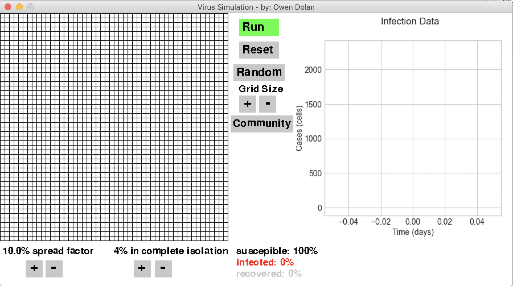
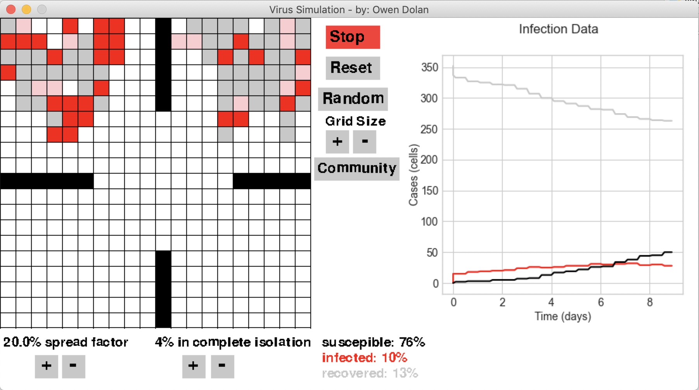
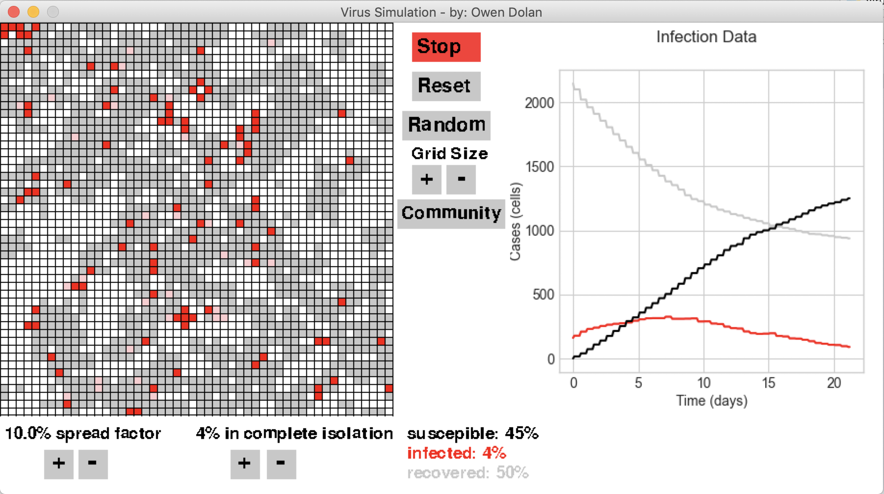

# Virus-Simulator
---
## SIR Illness Modeling
---

Within the main Grid() object there is a grid variable that stores a 2-D array with row and column data that represent each cell (person) in the grid (society)

### Each cell can store one of 6 values:
1. s = susceptible -> represented on the grid with any white cell and on the graphed with the black line
2. s-I susceptible in isolation (comes in contact with no one) -> represented by a white cell and graphed with the black line
3. i = infected -> represented as a red cell and on the graph with the red line 
4. i-a = infected but asymptomatic -> represented by pink cell and graphed with the red line
5. r = recovered -> represented by a gray cell and graphed with the gray line
6. c = community wall -> represented by a black cell and not graphed

### Rules:
1. Each generation (one day) is represented by the full iteration of the main while loop 
2. Any indivdual has at most 4 neighbors(if not in corner or against wall or side): Left, Right, Top, Bottom
3. If a cell has a neighbor that is infected there is a certain chance they will be infected controled by the spread factor
4. The more cells a contageous 

#### Data inputed into pygame graph (example):
| Time  | Susceptible  |  
| ----- |:------------:|  
| 0     | 2500         |  
| 1     | 2490         |  
| 2     | 2430         |  

| Time  | Infected     | 
| ----- |:------------:| 
| 0     | 0            | 
| 1     | 10           |  
| 2     | 60           | 

| Time  | Recovered    | 
| ----- |:------------:| 
| 0     | 0            | 
| 1     | 0            |  
| 2     | 10           | 

#### This data was used to plot three lines on the matplotlib graph canvas:
```python
ax.plot(time_sick, sick, '-', label='Infected Cases', color='#FF0000')  # infected cases
ax.plot(time_could_get_sick, could_get_sick, '-', label='Susceptible Cases', color='#c8c8c8')  # susceptible cases
ax.plot(time_better, better, '-', label='Recovered Cases', color='#000000')  # recovered cases
```
 
## Example of GUI when loaded:

## Example with smaller grid and communities turned on:

## Example of full sized grid running: 

